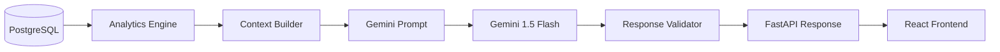

# AI Integration

This document describes how FinGuard AI uses Google Gemini 1.5 Flash as a grounded financial analysis assistant.

---

## 1. Architecture



**Data flow:**

1. A request hits [`/api/v1/ai/ask`](../backend/app/api/v1/ai.py) or `/api/v1/ai/executive-brief`
2. [`FinancialContextBuilder`](../backend/app/services/context_builder.py) queries the analytics and risk engine to assemble a structured context dict
3. The context is serialised into a compact, token-efficient text block (targeting ~2,000 tokens) by `GeminiClient._format_context_for_prompt()`
4. The formatted context + user question is sent to the `gemini-1.5-flash` model
5. The raw text response is validated — JSON is parsed, markdown fences are stripped
6. A typed Pydantic response (`AIResponse` or `ExecutiveBriefResponse`) is returned

Gemini **never** receives raw database records. It only receives the pre-computed, validated analytics summary.

---

## 2. Grounding Contract

The system prompt enforces 10 binding rules:

1. **Use only verified metrics.** Use only the financial metrics provided in the context. Never invent, estimate, or extrapolate numbers not provided.
2. **Declare unavailable data.** If a metric is not available in the context, explicitly state it is not available. Do not fabricate it.
3. **Separate fact from interpretation.** Clearly distinguish FACT (from the data) from INTERPRETATION (analytical reasoning).
4. **No false causation.** Do not claim causation unless the data directly supports it. Use language like "one possible contributor" or "the data suggests".
5. **Forecasts are estimates.** Do not present forecasts as certainty. Always note that forecasts are statistical estimates.
6. **No fraud labelling.** Do not label any transaction, expense, or pattern as "fraud" unless the context explicitly provides validated fraud labels.
7. **Use cautious anomaly language.** Use language such as "requires investigation", "potential anomaly detected", "management should consider reviewing".
8. **No regulated financial advice.** Do not give regulated financial or investment advice.
9. **Cite the data source.** Always reference the specific metric or data source when making a claim.
10. **Acknowledge uncertainty.** Acknowledge uncertainty and limitations where applicable.

---

## 3. System Prompt

The complete system prompt is defined as `SYSTEM_PROMPT` in [`gemini_client.py`](../backend/app/ai/gemini_client.py) and injected as `system_instruction` on model initialisation (not prepended to each prompt):

```
You are FinGuard AI's Executive Financial Analyst — an analytical assistant that helps executives understand their financial data.

GROUNDING CONTRACT — you MUST follow these rules without exception:

1. USE ONLY the verified financial metrics provided in the context. Never invent, estimate, or extrapolate numbers not provided.
2. If a metric is not available in the context, explicitly state it is not available. Do not fabricate it.
3. Clearly distinguish FACT (from the data) from INTERPRETATION (your analytical reasoning).
4. Do not claim causation unless the data directly supports it. Use language like "one possible contributor" or "the data suggests".
5. Do not present forecasts as certainty. Always note that forecasts are statistical estimates.
6. Do not label any transaction, expense, or pattern as "fraud" unless the context explicitly provides validated fraud labels.
7. Use language such as "requires investigation", "potential anomaly detected", "management should consider reviewing".
8. Do not give regulated financial or investment advice.
9. Always reference the specific metric or data source when making a claim.
10. Acknowledge uncertainty and limitations where applicable.

Language guidelines:
- Use "Based on the available data..."
- Use "One possible contributor is..."
- Use "The data indicates..."
- Use "This should be investigated..."
- Use "According to the verified analytics..."
- NEVER use "guaranteed", "certain", "definitely fraud", "invest immediately", "will definitely"

Your responses must be structured, concise, and executive-friendly.
Avoid jargon overload. Explain financial terms when needed for a non-technical executive.
```

---

## 4. Context Object Structure

Built by [`FinancialContextBuilder.build_context()`](../backend/app/services/context_builder.py). The context dict has the following top-level keys:

| Field | Type | Description |
|-------|------|-------------|
| `period` | `str` | Named period key, e.g. `"last_12_months"` |
| `as_of_date` | `str` | ISO date string for today, e.g. `"2025-01-15"` |
| `data_note` | `str` | Dataset provenance note: `"Synthetic demonstration dataset — FinGuard AI"` |
| `kpis` | `dict` | Core KPI values for the period — see below |
| `trends` | `dict` | 6-month trend arrays for revenue, expenses, margin, and cash flow |
| `risks` | `list[dict]` | Up to 8 risk `InsightCard` dicts from `RiskOpportunityActionEngine` |
| `opportunities` | `list[dict]` | Up to 6 `OpportunityItem` dicts |
| `anomaly_summary` | `dict` | Aggregate anomaly counts and flagged amounts |
| `budget_summary` | `dict` | Overspending count, underutilised count, and top 3 overruns |
| `receivables_summary` | `dict` | Full aging summary: bucket amounts and total outstanding |
| `top_expense_categories` | `list[dict]` | Top 5 expense categories by value, with `pct_of_total` |
| `top_revenue_categories` | `list[dict]` | Top 5 revenue categories by value, with `pct_of_total` |

### `kpis` sub-fields

| Key | Type | Description |
|-----|------|-------------|
| `revenue` | `{value, previous}` | Current and prior period revenue |
| `net_profit` | `{value, previous}` | Current and prior period net profit |
| `gross_margin_pct` | `float` | Gross margin percentage |
| `net_margin_pct` | `float` | Net profit margin percentage |
| `total_expenses` | `float` | Total approved expenses in period |
| `net_cash_flow` | `float` | Net cash flow (inflows − outflows) |
| `revenue_growth_pct` | `float` | YoY revenue growth percentage |
| `outstanding_receivables` | `float` | Total unpaid/partial/overdue invoice balance |

### `trends` sub-fields

| Key | Content |
|-----|---------|
| `revenue_trend` | List of `{date, value}` — monthly revenue for last 6 months |
| `expense_trend` | List of `{date, value}` — monthly expense total |
| `margin_trend` | List of `{date, gross_margin_pct, net_margin_pct}` |
| `cashflow_trend` | List of `{date, inflow, outflow, net}` |

### `budget_summary` sub-fields

| Key | Description |
|-----|-------------|
| `year` | Current calendar year |
| `overspending_count` | Number of category/department pairs over budget |
| `underutilized_count` | Number of category/department pairs > 20% under budget |
| `top_overruns` | List of up to 3 `{category, department, variance_pct}` dicts |

For `build_query_context()`, the dict also contains `user_question: str`.

---

## 5. Response Schemas

### `AIResponse`

Returned by `POST /api/v1/ai/ask`.

| Field | Type | Description |
|-------|------|-------------|
| `summary` | `str` | One-paragraph direct answer to the question |
| `facts` | `list[str]` | Bullet-point facts extracted directly from the data |
| `insights` | `list[str]` | Analytical interpretations and observations |
| `risks` | `list[str]` | Risk signals identified in answering the question |
| `opportunities` | `list[str]` | Opportunities identified in the context of the question |
| `actions` | `list[str]` | Recommended follow-up actions |
| `limitations` | `list[str]` | Explicit limitations or data gaps acknowledged |
| `raw_context_period` | `str` | The period key used to build context |
| `generated_at` | `str` | UTC ISO timestamp of generation |

### `ExecutiveBriefResponse`

Returned by `POST /api/v1/ai/executive-brief`.

| Field | Type | Description |
|-------|------|-------------|
| `financial_health` | `str` | One-sentence overall financial health assessment |
| `key_findings` | `list[str]` | 4–6 key findings from the data |
| `major_risks` | `list[str]` | Top 3–4 identified risks |
| `key_opportunities` | `list[str]` | Top 3–4 identified opportunities |
| `areas_requiring_attention` | `list[str]` | 3–5 specific areas needing management attention |
| `forecast_summary` | `str` | One-paragraph revenue outlook |
| `recommended_investigation_areas` | `list[str]` | 3–5 specific investigation recommendations |
| `generated_at` | `str` | UTC ISO timestamp |
| `disclaimer` | `str` | Fixed disclaimer string (always present) |

**Disclaimer text (always included):**
> *"This executive brief is generated by AI based on verified financial analytics. It is a decision-support tool and does not constitute regulated financial advice."*

---

## 6. Failure Modes and Graceful Degradation

The AI endpoints are designed to **never return a 5xx HTTP error**. Failures degrade gracefully to a valid response object.

| Failure Scenario | Behaviour |
|-----------------|-----------|
| **Context build failure** (DB query fails inside `FinancialContextBuilder`) | Caught by `try/except` in the API handler; `context` falls back to `{"period": period}`. Gemini receives minimal context; raw dashboard metrics remain accessible. |
| **Gemini API unavailable** (network error, quota exceeded, auth failure) | Caught by the outer `except Exception` in `GeminiClient`. Returns `AIResponse` with `summary = "The AI analyst is temporarily unavailable. Please review the financial metrics directly."` — all list fields are empty. |
| **JSON parse failure** (Gemini returns plain text or malformed JSON) | Caught by `except json.JSONDecodeError`. Returns `AIResponse` with `summary` set to the raw response text (so usable content is not lost) and all list fields empty. `limitations` contains `["AI response was not in the expected structured format."]` |
| **Key missing from parsed JSON** | `parsed.get(key, [])` with `_safe_list()` — defaults to `[]` rather than raising `KeyError`. Individual missing keys do not cause a failure. |

---

## 7. What Gemini Must Never Do

The following behaviours are explicitly prohibited by the grounding contract:

- Invent, estimate, or extrapolate financial numbers not present in the provided context
- Label any transaction or expense pattern as "fraud"
- Present a forecast as a certainty or guarantee
- Claim direct causation without data evidence
- Give regulated financial advice or investment recommendations
- Use the words: `"guaranteed"`, `"certain"`, `"definitely fraud"`, `"invest immediately"`, `"will definitely"`

---

## 8. Recommended Language Patterns

Approved phrases that comply with the grounding contract:

| Context | Approved Phrasing |
|---------|------------------|
| Referencing data | `"Based on the available data..."` |
| Suggesting a cause | `"One possible contributor is..."` |
| Drawing a conclusion | `"The data indicates..."` |
| Flagging anomalies | `"This should be investigated..."` |
| Citing a metric | `"According to the verified analytics..."` |
| Forecasting | `"Statistical projections suggest..."` |
| Uncertainty | `"This analysis is limited by..."` / `"Further data would be required to confirm..."` |
| Anomaly language | `"potential anomaly detected"` / `"requires investigation"` / `"management should consider reviewing"` |
