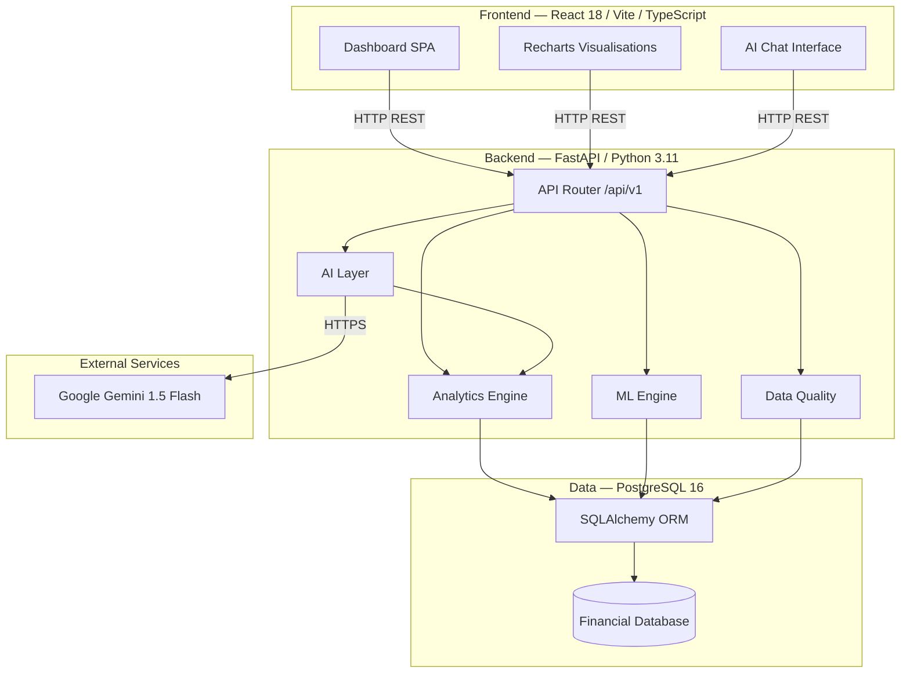
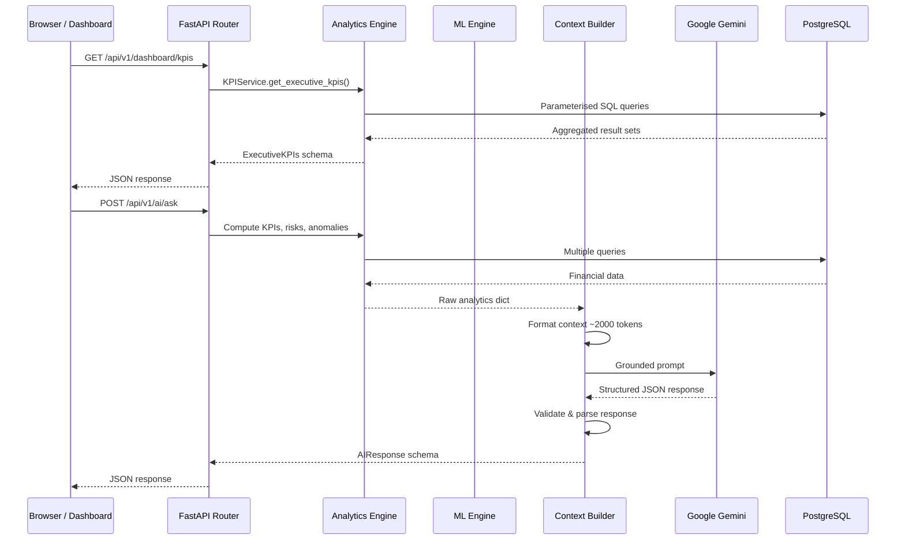

# Architecture — FinGuard AI

## System Overview

FinGuard AI follows a three-tier architecture: a React SPA frontend, a Python/FastAPI backend, and a PostgreSQL database. Machine learning inference and AI generation happen server-side within the backend tier.

---

## Data Flow Diagram

---

## Component Responsibilities

### Backend Components

#### `app/analytics/`

| Module | Responsibility |
|---|---|
| `kpis.py` | Core financial KPIs — revenue, margins, profit, cash flow, receivables, budget variance |
| `revenue.py` | Revenue trend series, category breakdown, region breakdown, product analysis |
| `expenses.py` | Expense trends, category heatmap, department comparison, top vendors |
| `profitability.py` | Gross/net margin analysis, department profitability, operating leverage |
| `cashflow.py` | Cash flow trends, waterfall analysis, operating/investing/financing breakdown |
| `budget.py` | Budget vs actual by category and department, variance ranking |
| `receivables.py` | Ageing buckets, overdue customer ranking, DSO calculation |

#### `app/ml/`

| Module | Responsibility |
|---|---|
| `forecasting.py` | Holt-Winters ETS forecast, TimeSeriesSplit cross-validation, confidence intervals |
| `risk_classifier.py` | XGBoost feature engineering, model training/inference, risk indicator computation |
| `anomaly_detection.py` | IQR expense anomaly detection, z-score transaction anomaly detection |

#### `app/ai/`

| Module | Responsibility |
|---|---|
| `gemini_client.py` | Gemini API integration, system prompt, context formatting, response parsing |

#### `app/services/`

| Module | Responsibility |
|---|---|
| `context_builder.py` | Assembles the analytics context dict from all analytics services for AI grounding |
| `data_quality.py` | Four-dimensional quality checks: completeness, consistency, validity, duplicates |
| `risk_engine.py` | Risk indicator evaluation, opportunity detection, action generation |

#### `app/api/v1/`

| Module | Endpoints |
|---|---|
| `dashboard.py` | `/dashboard/kpis` |
| `analytics.py` | `/analytics/revenue`, `/analytics/expenses`, `/analytics/profitability`, `/analytics/cash-flow`, `/analytics/budget`, `/analytics/receivables` |
| `forecast.py` | `/forecast/revenue` |
| `risk.py` | `/risk/score`, `/risk/anomalies`, `/risk/indicators` |
| `data_quality.py` | `/data-quality` |
| `ai.py` | `/ai/ask`, `/ai/executive-brief` |

---

## Technology Decisions

### Why FastAPI?

- Native async support via ASGI — handles I/O-bound DB queries efficiently
- Automatic OpenAPI/Swagger documentation
- Pydantic v2 integration for request/response validation
- Dependency injection system for clean DB session management

### Why PostgreSQL?

- Window functions and CTEs needed for rolling analytics
- `date_trunc()` for month/quarter aggregation
- `FILTER (WHERE ...)` on aggregate functions for conditional counts (used in data quality checks)
- Reliable CHECK constraints for domain validation

### Why SQLite for tests?

- In-memory SQLite eliminates external DB dependency for CI
- SQLAlchemy abstracts dialect differences for the ORM layer
- Raw SQL in DataQualityService requires minor compatibility notes (documented in `conftest.py`)

### Why Holt-Winters over ARIMA?

- ETS handles both trend and seasonality in a single model
- More stable on short series (24 months) than ARIMA with seasonal differencing
- Statsmodels implementation is well-tested and maintained

### Why XGBoost for risk classification?

- Handles mixed feature scales without normalisation
- Feature importance is directly interpretable (used in risk UI)
- Robust to the small dataset size (rule-labelled training data)

### Why Gemini 1.5 Flash?

- Large context window (1M tokens) — can receive rich analytics context
- Fast inference latency suitable for interactive Q&A
- Free tier available for development and demonstration
- Structured JSON output mode available for reliable response parsing

---

## Security Considerations

> ⚠️ The current implementation does not include authentication or authorisation. The following additions are required before any production use:

1. **JWT authentication** — add `python-jose` or `authlib`, protect all `/api/v1/*` endpoints with `Depends(get_current_user)`
2. **HTTPS only** — configure TLS termination at the load balancer or nginx proxy level
3. **API key rotation** — Gemini API key must be stored in a secrets manager, not in `.env` files, in production
4. **Database credentials** — use IAM authentication or secrets manager, never hardcoded connection strings
5. **CORS** — tighten `allow_origins` to specific production domains
6. **Rate limiting** — add `slowapi` middleware to prevent abuse of the AI endpoints
